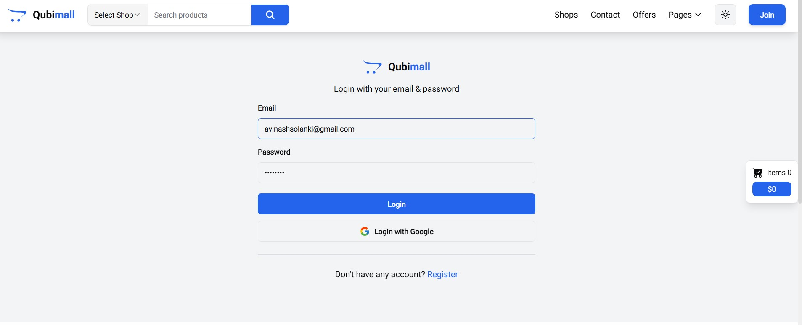
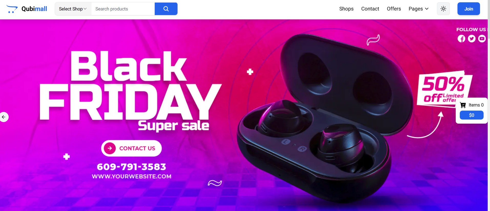
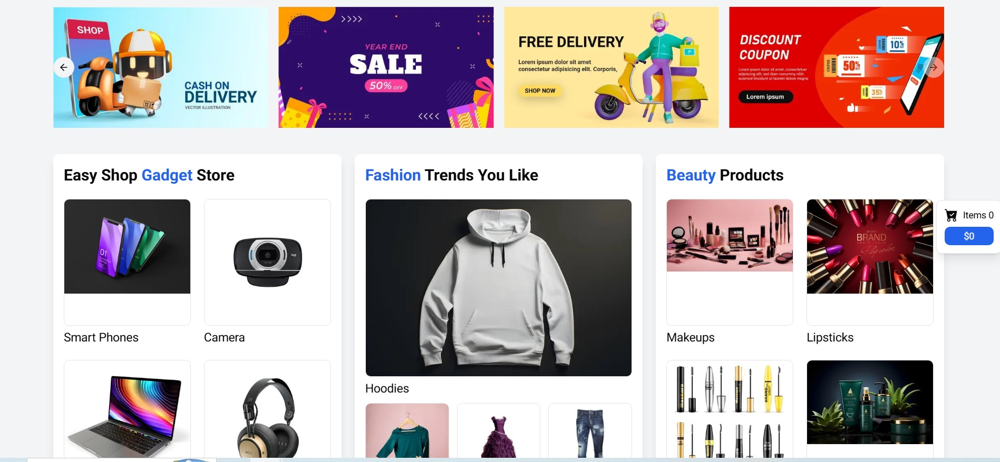
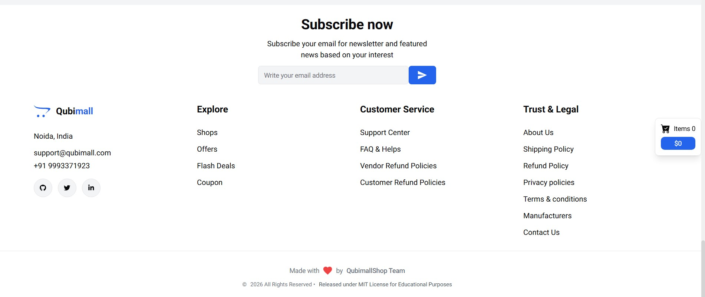
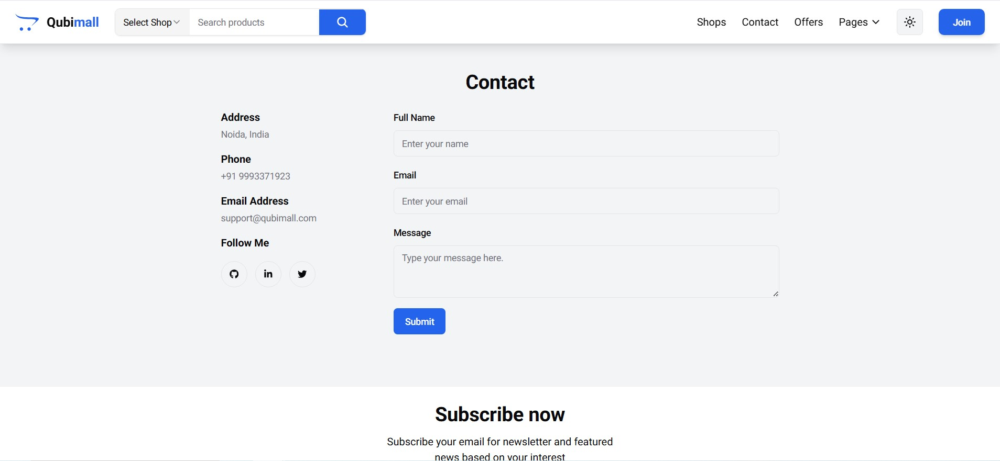

# QubiMall - Modern E-commerce Platform

[](https://nextjs.org/)
[](https://www.typescriptlang.org/)
[](https://www.mongodb.com/)
[](https://redux.js.org/)
[](https://kubernetes.io/)
[](https://www.terraform.io/)
[](https://www.jenkins.io/)
[](LICENSE)

QubiMall is a modern, full-stack e-commerce platform built with **Next.js 14**, **TypeScript**, and **MongoDB**. It features a responsive UI with Tailwind CSS, JWT-based authentication, Redux state management, and a complete CI/CD pipeline deployed on AWS EKS via Terraform, Jenkins, and Argo CD.

## Features

- Modern and responsive UI with dark/light theme support
- Secure JWT-based authentication (login, register, logout)
- Real-time cart management with Redux Toolkit
- Product catalog with search, filtering, and pagination
- Multiple shop categories (Books, Bakery, Grocery, etc.)
- Product variants (colors, sizes) support
- User profiles, order history, and wishlists
- Checkout with shipping/billing address forms
- Mobile-first responsive design with bottom navigation
- Server-side rendering with Next.js App Router
- Docker containerization with multi-stage builds
- Kubernetes deployment on AWS EKS
- Automated CI/CD with Jenkins and Argo CD

## Architecture

```mermaid
graph TB
    subgraph "Client Layer"
        B[Browser]
    end

    subgraph "CDN / DNS"
        CDN[Cloudflare / Route53]
    end

    subgraph "Kubernetes Cluster - AWS EKS"
        subgraph "Ingress Layer"
            ING[NGINX Ingress Controller]
            CM[Cert-Manager<br/>Let's Encrypt]
        end

        subgraph "Frontend Pods"
            NEXT[Next.js App<br/>Server Components + API Routes]
        end

        subgraph "State Management"
            REDUX[Redux Toolkit<br/>Cart | Auth | Sidebar]
        end

        subgraph "Database Layer"
            MONGO[(MongoDB<br/>StatefulSet + PVC)]
        end
    end

    subgraph "CI/CD Pipeline"
        GH[GitHub]
        JENKINS[Jenkins<br/>Pipeline]
        DOCKER[DockerHub<br/>Image Registry]
        ARGO[Argo CD<br/>GitOps]
    end

    subgraph "Infrastructure Provisioning"
        TF[Terraform<br/>AWS Provider]
        VPC[VPC + Subnets]
        EKS[EKS Cluster<br/>Node Groups]
        EC2[Bastion Host<br/>EC2]
    end

    B --> CDN --> ING
    ING --> NEXT
    NEXT --> REDUX
    NEXT --> MONGO
    CM -.-> ING

    GH -->|webhook| JENKINS
    JENKINS -->|build & push| DOCKER
    JENKINS -->|update manifests| GH
    ARGO -->|sync| GH
    ARGO -->|deploy| NEXT

    TF --> VPC
    TF --> EKS
    TF --> EC2
```

## Project Structure

```
QubiMall-ecommerce/
├── src/
│   ├── app/                    # Next.js App Router
│   │   ├── (auth)/            # Login & Register pages
│   │   ├── api/               # REST API routes
│   │   │   ├── auth/          # Login, register, logout, me, check
│   │   │   ├── cart/          # Cart CRUD operations
│   │   │   ├── orders/        # Order management
│   │   │   ├── products/      # Product CRUD, search, filter
│   │   │   └── singleProduct/ # Single product by slug
│   │   ├── checkout/          # Checkout flow
│   │   ├── contact/           # Contact page
│   │   ├── offers/            # Offers & deals
│   │   ├── orders/            # Order tracking
│   │   ├── products/          # Product detail pages
│   │   ├── profile/           # User profile, orders, wishlists
│   │   └── shops/             # Shop listing by category
│   ├── components/            # UI components
│   │   ├── cards/             # Product, wishlist cards
│   │   ├── checkout/          # Order summary
│   │   ├── filters/           # Search filters (price, color, category)
│   │   ├── forms/             # Login, signup, address forms
│   │   ├── heros/             # Hero slider
│   │   ├── loader/            # Loading skeletons
│   │   ├── profile/           # Profile sidebar & order table
│   │   ├── providers/         # Auth provider
│   │   ├── sidebars/          # Filter sidebars
│   │   ├── sliders/           # Product & book sliders
│   │   └── ui/                # shadcn/ui components
│   ├── lib/
│   │   ├── models/            # Mongoose models (User, Product, Order, Cart)
│   │   ├── features/          # Redux slices (auth, cart, sidebar)
│   │   ├── auth/              # JWT utils (sign, verify, middleware)
│   │   ├── db.ts              # MongoDB connection (cached)
│   │   └── store.ts           # Redux store configuration
│   ├── data/                  # Static data (categories, colors, shops)
│   └── middleware.ts          # Next.js middleware for route protection
├── kubernetes/                # K8s manifests (13 files)
│   ├── 00-cluster-issuer.yml  # Let's Encrypt ClusterIssuer
│   ├── 01-namespace.yaml      # qbshop namespace
│   ├── 02-mongodb-pv.yaml     # PersistentVolume
│   ├── 03-mongodb-pvc.yaml    # PersistentVolumeClaim
│   ├── 04-configmap.yaml      # App config
│   ├── 05-secrets.yaml        # Secrets
│   ├── 06-mongodb-service.yaml
│   ├── 07-mongodb-statefulset.yaml
│   ├── 08-qbshop-deployment.yaml
│   ├── 09-qbshop-service.yaml
│   ├── 10-ingress.yaml        # NGINX Ingress + TLS
│   ├── 11-hpa.yaml            # Horizontal Pod Autoscaler
│   └── 12-migration-job.yaml  # Data migration job
├── terraform/                 # IaC for AWS
│   ├── provider.tf            # AWS provider, region ap-south-1
│   ├── vpc.tf                 # VPC module (public/private/intra subnets)
│   ├── eks.tf                 # EKS cluster + managed node groups
│   ├── ec2.tf                 # Bastion host
│   └── variables.tf           # Input variables
├── scripts/                   # Data migration scripts
├── docker-compose.yml         # Local dev (MongoDB + App + Migration)
├── Dockerfile                 # Multi-stage production build
├── Dockerfile.dev             # Development image
├── jenkinsfile                # Jenkins pipeline
├── next.config.js             # Next.js config (standalone output)
└── tailwind.config.ts         # Tailwind CSS theme
```

## Tech Stack

| Layer | Technology |
|-------|-----------|
| Framework | Next.js 14 (App Router) |
| Language | TypeScript 5 |
| Styling | Tailwind CSS, shadcn/ui, Framer Motion |
| State | Redux Toolkit, React Redux |
| Database | MongoDB 8, Mongoose 8 |
| Auth | JWT (jose library), bcryptjs |
| Forms | react-hook-form, zod |
| Container | Docker, Docker Compose |
| Orchestration | Kubernetes (AWS EKS) |
| CI/CD | Jenkins, Argo CD |
| IaC | Terraform (AWS) |
| Ingress | NGINX Ingress Controller |
| TLS | Cert-Manager + Let's Encrypt |

## API Endpoints

| Method | Endpoint | Description | Auth |
|--------|----------|-------------|------|
| POST | `/api/auth/register` | Register new user | No |
| POST | `/api/auth/login` | Login, returns JWT | No |
| POST | `/api/auth/logout` | Logout, clear cookie | No |
| GET | `/api/auth/me` | Get current user | Yes |
| GET | `/api/auth/check` | Check auth status | No |
| GET | `/api/products` | List products (search, filter, sort, page) | No |
| POST | `/api/products` | Create product | Admin |
| GET | `/api/products/featured` | Featured products | No |
| GET | `/api/products/books` | Books category | No |
| GET | `/api/products/:id` | Single product | No |
| GET | `/api/singleProduct/:slug` | Product by slug | No |
| GET | `/api/cart` | Get user cart | Yes |
| POST | `/api/cart` | Add/update cart item | Yes |
| DELETE | `/api/cart` | Clear cart | Yes |
| GET | `/api/orders` | List user orders | Yes |
| POST | `/api/orders` | Create order | Yes |
| GET | `/api/orders/:id` | Order details | Yes |

## API Middleware

- `src/middleware.ts` - Protects `/checkout`, `/profile`, `/admin` routes
- `src/lib/auth/utils.ts` - JWT generation, verification, role-based access
- Tokens stored in HTTP-only cookies + Authorization header support

## Getting Started - Local Development

### Prerequisites
- Node.js 18+
- Docker & Docker Compose
- MongoDB (local or Docker)

### Setup

```bash
# Clone the repository
git clone https://github.com/anil2211/QubiMall-ecommerce.git
cd QubiMall-ecommerce

# Install dependencies
npm install

# Start MongoDB and app with Docker Compose
docker-compose up -d

# Or run locally with environment variables
cp .env.example .env.local
npm run dev
```

The app will be available at `http://localhost:3000`.

## Infrastructure Deployment (AWS EKS)

### 1. Prerequisites
- Terraform >= 1.2, < 2.0
- AWS CLI configured with appropriate IAM credentials
- SSH key pair for EC2 access

### 2. Provision Infrastructure

```bash
cd terraform
terraform init
terraform plan
terraform apply
```

This provisions:
- VPC with public/private/intra subnets across 2 AZs
- EKS cluster with managed node groups (t2.large, SPOT, 2-3 nodes)
- Bastion EC2 host for cluster access

### 3. Configure kubectl

```bash
aws eks --region ap-south-1 update-kubeconfig --name qualibytes-eks-cluster
kubectl get nodes
```

## CI/CD Pipeline

The Jenkins pipeline (`jenkinsfile`) automates:

1. **Build** - Two parallel Docker image builds:
   - Main app image (`anilvcr/qbshop-app`)
   - Migration image (`anilvcr/qbshop-migration`)
2. **Test** - Run unit tests
3. **Security** - Trivy vulnerability scan
4. **Push** - Push images to DockerHub
5. **Deploy** - Update Kubernetes manifests via shared library

Shared library (`jenkins-shared-library/`) provides reusable pipeline steps.

### Jenkins Setup

1. Install plugins: Docker Pipeline, Pipeline View
2. Configure credentials:
   - `github-credentials` (Username with password)
   - `docker-hub-credentials` (Username with password)
3. Configure shared library: `github.com/<your-user>/jenkins-shared-libraries`
4. Create pipeline job with SCM from `QubiMall-ecommerce` repo, `Jenkinsfile` path

## GitOps with Argo CD

Argo CD is deployed on the EKS cluster for continuous delivery:

```bash
kubectl create namespace argocd
kubectl apply -n argocd -f https://raw.githubusercontent.com/argoproj/argo-cd/stable/manifests/install.yaml
```

Access the Argo CD UI via port-forward and deploy applications by pointing to the Kubernetes manifests in this repository.

## Kubernetes Manifests

All manifests are in `kubernetes/`:

| File | Resource |
|------|----------|
| `00-cluster-issuer.yml` | Let's Encrypt ClusterIssuer |
| `01-namespace.yaml` | `qbshop` namespace |
| `02-mongodb-pv.yaml` | 10Gi PersistentVolume |
| `03-mongodb-pvc.yaml` | PersistentVolumeClaim |
| `04-configmap.yaml` | MONGODB_URI, JWT_SECRET, NEXTAUTH_URL |
| `05-secrets.yaml` | Sensitive config |
| `06-mongodb-service.yaml` | MongoDB ClusterIP service |
| `07-mongodb-statefulset.yaml` | MongoDB StatefulSet |
| `08-qbshop-deployment.yaml` | Next.js app (3 replicas) |
| `09-qbshop-service.yaml` | App ClusterIP service |
| `10-ingress.yaml` | NGINX Ingress with TLS |
| `11-hpa.yaml` | CPU-based autoscaler |
| `12-migration-job.yaml` | Data seed migration |

### HTTPS Setup

1. Install NGINX Ingress Controller:
   ```bash
   helm install nginx-ingress ingress-nginx/ingress-nginx \
     --namespace ingress-nginx \
     --set controller.service.type=LoadBalancer
   ```

2. Install Cert-Manager:
   ```bash
   helm install cert-manager jetstack/cert-manager \
     --namespace cert-manager --create-namespace \
     --version v1.12.0 --set installCRDs=true
   ```

3. Apply manifests:
   ```bash
   kubectl apply -f kubernetes/00-cluster-issuer.yml
   kubectl apply -f kubernetes/04-configmap.yaml
   kubectl apply -f kubernetes/10-ingress.yaml
   ```

4. Create a DNS CNAME record pointing to the LoadBalancer hostname.

## Screenshots

<div align="center">

### Login & Signup

<p float="left">
  
</p>

### Dashboard

<p float="left">
  
  
</p>

### History & Study Plan

<p float="left">
  
  
</p>

</div>

## License

Distributed under the MIT License. See `LICENSE` for more information.
